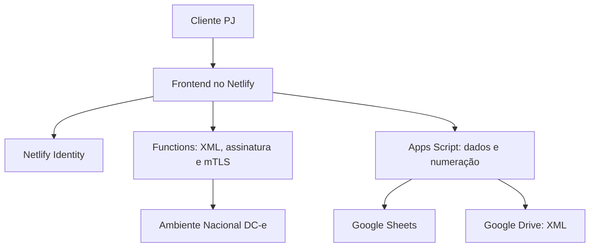

# DC-e Fácil

Aplicação web para que a própria pessoa jurídica não contribuinte do ICMS emita DC-e para remessas PAC e SEDEX à vista, usando o próprio e-CNPJ. O software não emite como agência dos Correios, transportadora, marketplace ou ECT.

## O que está implementado

- login e isolamento por usuário com Netlify Identity;
- cadastro do emitente CNPJ, série e numeração sequencial;
- importação de qualquer quantidade de linhas em CSV e XML;
- união de CSV e XML pelo código SRO e mapeamento visual de colunas;
- reconhecimento das colunas do relatório de etiquetas dos Correios;
- preenchimento em massa de conteúdo, quantidade, valor e NCM;
- resolução editável do código do município pela API oficial do IBGE;
- validação de CPF, CNPJ, endereços, itens, PAC/SEDEX e código SRO;
- formação e dígito verificador da chave de acesso de 44 posições;
- emissão própria com `mod=99`, `tpEmit=2`, `tpEmis=1`, `nSiteAutoriz=0` e `modTrans=0`;
- assinatura XML envelopada RSA-SHA1 com certificado A1 do cliente;
- TLS 1.2 mútuo com os serviços nacionais da DC-e;
- consulta de status do serviço antes de reservar números;
- autorização, consulta por chave e evento de cancelamento;
- persistência de XML assinado e processado no Google Drive;
- DACE completa em PDF com folhas adicionais, Code 128, QR Code, protocolo e avisos legais;
- ambientes de homologação e produção, com confirmações explícitas;
- certificado e senha usados apenas na memória da requisição.

O serviço de autorização aceita uma DC-e por mensagem. Por isso, o lote é orquestrado pelo aplicativo: ele percorre qualquer total de remessas em chamadas pequenas e grava o resultado de cada documento.

## Arquitetura



O Apps Script não faz a transmissão fiscal porque `UrlFetchApp` não oferece o certificado cliente PKCS#12 necessário ao TLS mútuo. Essa etapa fica numa Netlify Function, sem persistir o arquivo A1.

## 1. Preparar o Apps Script

1. Crie um projeto independente em [script.google.com](https://script.google.com/).
2. Copie todos os arquivos `.gs` da pasta `apps-script/` para o projeto.
3. Em **Configurações do projeto**, marque a opção para exibir o manifesto e substitua o conteúdo por `apps-script/appsscript.json`.
4. Execute manualmente `setupProject()` uma vez e autorize Sheets e Drive. A função retorna os links da planilha e da pasta criadas.
5. Gere um segredo aleatório com pelo menos 32 caracteres e execute uma vez:

```javascript
setApiToken('COLE_AQUI_O_SEGREDO_LONGO')
```

6. Clique em **Implantar > Nova implantação > Aplicativo da Web**.
7. Execute como **você** e permita acesso a **qualquer pessoa**. A API continua protegida pelo segredo, e o frontend só a acessa através da função autenticada do Netlify.
8. Copie a URL terminada em `/exec`.

Para atualizar depois, crie uma nova versão da mesma implantação. Não coloque o segredo no repositório.
Sempre que atualizar os arquivos `.gs`, execute `setupProject()` novamente antes de publicar a nova versão; a rotina migra as colunas pelo nome e preserva os dados existentes.

## 2. Publicar no GitHub e Netlify

No terminal do VS Code, dentro desta pasta:

```bash
git init
git add .
git commit -m "Emissor DC-e inicial"
git branch -M main
git remote add origin URL_DO_SEU_REPOSITORIO
git push -u origin main
```

No Netlify:

1. use **Add new project > Import an existing project** e selecione o repositório;
2. o `netlify.toml` já configura `npm run build`, a pasta `dist` e as Functions;
3. habilite **Identity** e, para produção, prefira cadastro por convite;
4. cadastre estas variáveis em **Project configuration > Environment variables**:

| Variável | Valor |
|---|---|
| `APPS_SCRIPT_URL` | URL `/exec` da implantação do Apps Script |
| `APPS_SCRIPT_TOKEN` | mesmo segredo usado em `setApiToken()` |
| `OPERATIONS_APPS_SCRIPT_URL` | URL `/exec` da implantação operacional usada por eleições e Portal Postal |
| `OPERATIONS_APPS_SCRIPT_TOKEN` | segredo da implantação operacional; mantenha separado do token fiscal |
| `DCE_ALLOW_DEV_AUTH` | `false` em produção |
| `DCE_MAX_PER_REQUEST` | `5` é um valor conservador |

Os endpoints e SOAPActions oficiais já têm valores padrão. Todas as opções estão documentadas em `.env.example` para permitir ajuste sem alterar código caso o WSDL seja atualizado.

## 3. Testar corretamente

1. Entre com um usuário de teste.
2. Cadastre uma PJ não contribuinte do ICMS e a série `0`.
3. Importe uma amostra pequena e complete CPF/CNPJ, conteúdo, quantidade, valor e código IBGE.
4. Selecione **Homologação**.
5. Use um e-CNPJ A1 válido cujo CNPJ-base corresponda ao emitente.
6. Confira o retorno de cada DC-e, baixe o XML processado e leia o QR Code da DACE.
7. Teste consulta e cancelamento.
8. Só depois faça um lote mínimo em produção e valide o documento com a área fiscal/contábil.

Não há certificado de demonstração no projeto. Os testes automatizados validam chave, estrutura XML, assinatura e geração do PDF, mas uma autorização real depende de e-CNPJ válido e acesso ao ambiente oficial.

## Desenvolvimento local

```bash
npm install
npm run test
npm run build
```

Para testar o backend localmente, use o Netlify CLI e defina `DCE_ALLOW_DEV_AUTH=true` somente no arquivo local de variáveis. O Netlify Identity deve ser validado numa implantação de preview, pois a autenticação não funciona integralmente em `netlify dev`.

## Estrutura do projeto

```text
apps-script/                 cadastros, importações, numeração e arquivo fiscal
netlify/functions/_shared/  chave, XML, certificado, assinatura, SOAP e DACE
netlify/functions/          endpoints autenticados
src/                        interface, importador e validações no navegador
tests/                      testes da chave, XML, assinatura e PDF
```

## Regras importantes preservadas

- a emissão própria é apenas para usuário emitente CNPJ não contribuinte;
- `emit.CNPJ` e `EmpEmisProp.CNPJ` são o CNPJ do cliente, não o da agência;
- o CNPJ-base do certificado deve corresponder ao emitente;
- o A1 e sua senha nunca são enviados ao Apps Script nem gravados no Sheets, Drive ou browser storage;
- cada número e código numérico da chave são reservados antes da transmissão e não mudam numa repetição;
- a mensagem XML é bloqueada acima do limite oficial de 500 KB;
- uma DACE só é gerada quando o retorno está autorizado;
- este frontend aceita A1 `.pfx/.p12`. A3 exige integração local com token/cartão e não é apropriado para uma aplicação hospedada comum.

## Documentação oficial utilizada

- [Documentos técnicos da DC-e](https://dfe-portal.svrs.rs.gov.br/Dce/Documentos)
- [Serviços e endpoints nacionais](https://dfe-portal.svrs.rs.gov.br/dce/Servicos)
- [FAQ da DC-e](https://dfe-portal.svrs.rs.gov.br/Dce/Faq)
- [Ajuste SINIEF 05/2021](https://www.confaz.fazenda.gov.br/legislacao/ajustes/2021/ajuste-sinief-05-21)
- [API de Localidades do IBGE](https://servicodados.ibge.gov.br/api/docs/localidades)

A documentação técnica publicada contém divergências pontuais entre a tabela do manual e alguns XSD disponibilizados, especialmente nos campos opcionais e no grupo de emissão própria após a inclusão da ECT. O gerador segue o leiaute e as regras do Manual Anexo I e da NT 2024.001 v1.30 para `tpEmit=2`; qualquer mudança futura deve ser confirmada primeiro em homologação.
